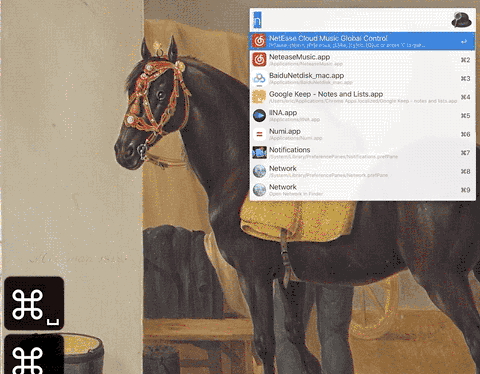
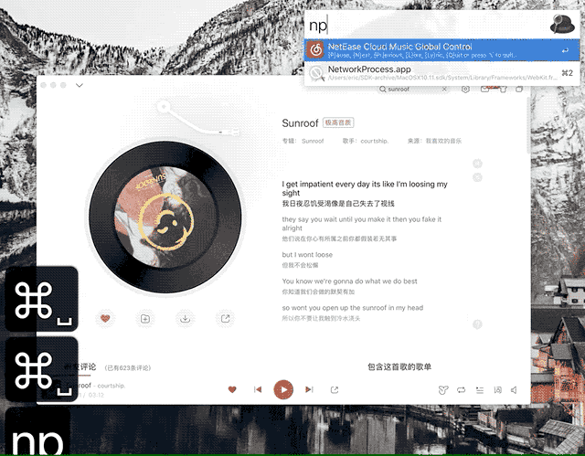

# Oh My Alfred!!

Alfred awesome workflows.

主子您值得拥有！

---

# 下载

> [Workflow Releases](https://github.com/lroolle/ohmyalfred/releases)

---

# 欧路快查

Alfred 欧路快查！

## Usage 开始使用

### 1). 关键词: `eu`

-   在 Alfred 搜索框输入 `eu` + `回车`: 打开欧路词典;

    

-   在 Alfred 搜索框输入 `eu apocalypse` + `回车`: 打开欧路词典并查词 `apocalypse`;

    

### 2). 快捷键：`Shift-Command-E`

选中单词，按快捷键（可根据喜好自行设置），窗口会自动跳转到欧路词典查询。

---

# 网易云音乐全局操控

还在纠结埋头苦干时怎么切歌？还在纠结设置什么快捷键？还在纠结记不住键位、键位冲突？

macOS Alfred 4 网易云全局快捷控制！

全局快捷不用记 && 键位冲突不纠结！！

---

# Usage 开始使用

## 1). 关键词 `n`

-   启动/打开网易云: 在 Alfred 搜索框输入 `n` + `回车`；
-   退出网易云(正在运行时): 输入 `n`，按住 `⌥Option` + `回车`，此时 Alfred 输入框出现确认 `quit NeteaseMusic`，再次输入回车退出网易云音乐；

## 2). `n` + 动作缩略

> 在 Alfred 搜索框输入快捷动作，控制网易云播放等

比如:

-   输入 `np` + `回车` ([N]eteaseMusic [P]lay)，开始播放（如果网易云未打开会自动打开窗口）;
-   正在播放状态输入 `np` + `回车` ([N]eteaseMusic [P]ause)，暂停播放;
-   输入 `nly` + `回车` ([N]eteaseMusic [Ly]rics)，显示/隐藏歌词;

-   输入 `nn` + `回车` ([N]eteaseMusic [N]ext)，开始播放下一首;
-   输入 `nl` + `回车` ([N]eteaseMusic [L]ike)，添加到喜欢（或者取消喜欢）;

### 具体如下：

|          |                |                |
| -------- | -------------- | -------------- |
| **`p`**  | `P`lay/`P`ause | 播放/暂停      |
| **`n`**  | `N`ext         | 下一曲         |
| **`pr`** | `Pr`evious     | 上一曲         |
| **`l`**  | `L`ike         | 添加到喜欢     |
| **`s`**  | `S`huffle      | 随机播放       |
| **`a`**  | `A`ll          | 列表循环       |
| **`1`**  | `1`            | 单曲循环       |
| **`>`**  | `>`            | 顺序播放       |
| **`ly`** | `Ly`rics       | 显示/隐藏歌词  |
| **`v+`** | `V`olume+      | 提高音量       |
| **`v-`** | `V`olume+      | 降低音量       |
| **`h`**  | `H`ide         | 隐藏窗口       |
| **`q`**  | `Q`uit         | 退出网易云音乐 |
